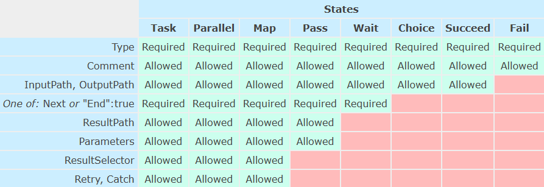

# States Overview

This document provides a comprehensive technical overview of each state in the `DynaFlow` library. States are modular components that represent steps in a flow, each performing a specific function and transitioning to the next state based on defined rules.

## Common Attributes Across States

All states share the following attributes and depending on the state type, depending on the state type, some settings can be enabled or not and can have additional attributes.

- Type (string, required): Specifies the type of the state (e.g., Task, Choice, Map).
- Comment (string, optional): A description or note about the state.
- InputPath (string, optional): A JSONPath expression to filter the input before the state processes it.
- Parameters (object | array | string, optional): Allows transforming the input data before processing.
- ResultSelector (object | array | string, optional): Modifies the state’s output before merging with the input.
- ResultPath (string, optional): Specifies where to insert the state result in the input data.
- OutputPath (string, optional): A JSONPath expression to filter the output after the state processes it.

You can see it in summary in the following image



# State Types


## Task State

* Type: `Task`
* Description: Executes a predefined function using input data.
* Supported Attributes:
  - Data Manipulation: Fully supports `InputPath`, `Parameters`, `ResultSelector`, `ResultPath`, and `OutputPath`.
  - Error Handling: Supports `Retry` and `Catch` policies.
* Attributes:
  - `Function` (object, required): Specifies the function to execute.
    - `Name` (string, required): The name of the function.
    - `Version` (integer or string, optional): The version of the function.
  - `Retry` (array, optional): Configures retry policies for the task.
  - `Catch` (array, optional): Defines error handling strategies for the task.

* Example List:
    ```json
    [
        {
            "Type": "Task",
            "Function": {"Name": "add", "Version": 1},
            "Parameters": {"a": 5, "b": 10},
            "Next": "Decision"
        },
        {
            "Type": "Task",
            "Function": {"Name": "sub", "Version": 1},
            "Parameters": {"a": 5, "b": 10},
            "End": true
        },
        {
            "Type": "Task",
            "InputPath": "$",
            "Parameters": {"a": 5, "b": 10, "c": "$.price"},
            "Function": {"Name": "multiply", "Version": 1},
            "ResultSelector": {"result": "$"},
            "ResultPath": "$.new_price",
            "OutputPath": "$.new_price.result.output",
        }
    ]
    ```

## Choice State

* Type: `Choice`
* Description: Implements conditional branching based on input data.
* Supported Attributes:
  - Data Manipulation: Does not support manipulation attributes (e.g., InputPath or OutputPath).
  - Error Handling: Not applicable.
* Attributes:
    - `Choices` (array, required): Defines the conditions and transitions.
    - `Default` (string, required): Specifies the default transition if no conditions are met.
* Condition Functions:
    - `string_equals`
    - `string_less_than`
    - `string_greater_than`
    - `string_less_than_equals`
    - `string_greater_than_equals`
    - `string_matches`
    - `numeric_equals`
    - `numeric_less_than`
    - `numeric_greater_than`
    - `numeric_less_than_equals`
    - `numeric_greater_than_equals`
    - `boolean_equals`
    - `timestamp_equals`
    - `timestamp_less_than`
    - `timestamp_greater_than`
    - `timestamp_less_than_equals`
    - `timestamp_greater_than_equals`
    - `is_null`
    - `is_element_present`
    - `is_numeric`
    - `is_string`
    - `is_boolean`
    - `is_timestamp`
* You can use `And`, `Or`, and `Not` for complex conditions.

* Example List:
    ```json
    [
        {
            "Type": "Choice",
            "Choices": [
                {
                    "Variable": "$.result",
                    "numeric_greater_than": 10,
                    "Next": "Success"
                }
            ],
            "Default": "Failure"
        },
        {
            "Type": "Choice",
            "Choices": [
                {
                    "Variable": "$.result",
                    "string_equals": "success",
                    "Next": "Success"
                },
                {
                    "Variable": "$.result",
                    "string_equals": "failure",
                    "Next": "Failure"
                }
            ],
            "Default": "Error"
        },
        {
            "Type": "Choice",
            "Choices": [
                {
                    "And": [
                        {
                            "Variable": "$.result",
                            "numeric_greater_than": 10
                        },
                        {
                            "Variable": "$.result",
                            "numeric_less_than": 20
                        }
                    ],
                    "Next": "Success"
                }
            ],
            "Default": "Failure"
        },
        {
            "Type": "Choice",
            "Choices": [
                {
                    "Or": [
                        {
                            "Variable": "$.result",
                            "numeric_equals": 10
                        },
                        {
                            "Variable": "$.result",
                            "numeric_greater_than": 20
                        }
                    ],
                    "Next": "Success"
                }
            ],
            "Default": "Failure"
        },
        {
            "Type": "Choice",
            "Choices": [
                {
                    "Not": {
                        "Variable": "$.result",
                        "numeric_equals": 10
                    },
                    "Next": "Success"
                }
            ],
            "Default": "Failure"
        }
    ]
    ```

## Wait State

* Type: `Wait`
* Description: Introduces a delay before transitioning to the next state.
* Supported Attributes:
  - Data Manipulation: Supports `InputPath` and `OutputPath`.
  - Error Handling: Not applicable.
* Attributes:
    - `Seconds` (integer, required): The number of seconds to wait.
* Example:
    ```json
    {
        "Type": "Wait",
        "Seconds": 5,
        "Next": "Task"
    }
    ```

## Pass State

* Type: `Pass`
* Description: Passes input to output without any processing.
* Supported Attributes:
  - Data Manipulation: Supports `InputPath`, `Parameters`, `ResultSelector`, `ResultPath`, and `OutputPath`.
  - Error Handling: Not applicable.
* List of Examples:
    ```json
    [
        {
            "Type": "Pass",
            "InputPath": "$.data",
            "OutputPath": "$.result",
            "Next": "Task"
        },
        {
            "Type": "Pass",
            "InputPath": "$.data",
            "Parameters": {"a": "$.a", "b": "$.b"},
            "ResultPath": "$.result",
            "End": true
        }
    ]
    ```

## Succeed State

* Type: `Succeed`
* Description: Marks the flow as successful and ends execution.
* Supported Attributes:
  - Data Manipulation: Supports `InputPath`, and `OutputPath`.
  - Error Handling: Not applicable.
* Example:
    ```json
    {
        "Type": "Succeed",
        "InputPath": "$.data",
        "OutputPath": "$.result"
        "Comment": "Flow completed successfully."
    }
    ```

## Fail State

* Type: `Fail`
* Description: Marks the flow as failed and ends execution.
* Supported Attributes:
  - Data Manipulation: Does not support manipulation attributes.
  - Error Handling: Not applicable.
* Attributes:
    - `Error` (string, optional): Specifies the error message.
    - `Cause` (string, optional): Provides additional context about the error.
* Example:
    ```json
    {
        "Type": "Fail",
        "Error": "InvalidInput",
        "Cause": "Input data is missing required fields."
    }
    ```

## Parallel State

* Type: `Parallel`
* Description: Runs multiple branches.
* Supported Attributes:
  - Data Manipulation: Fully supports `InputPath`, `Parameters`, `ResultSelector`, `ResultPath`, and `OutputPath`.
  - Error Handling: Supports `Retry` and `Catch` policies.
* Attributes:
    - `Branches` (array, required): Defines the parallel branches.
    - `Retry` (array, optional): Configures retry policies for the parallel state.
    - `Catch` (array, optional): Defines error handling strategies for the parallel state.
* Example:
    ```json
    {
        "Type": "Parallel",
        "Branches": [
            {
                "StartAt": "Task1",
                "States": {
                    "Task1": {
                        "Type": "Task",
                        "Function": {"Name": "add", "Version": 1},
                        "Parameters": {"a": 5, "b": 10},
                        "Next": "Task2"
                    },
                    "Task2": {
                        "Type": "Task",
                        "Function": {"Name": "sub", "Version": 1},
                        "Parameters": {"a": 5, "b": 10},
                        "End": true
                    }
                }
            },
            {
                "StartAt": "Task3",
                "States": {
                    "Task3": {
                        "Type": "Task",
                        "Function": {"Name": "multiply", "Version": 1},
                        "Parameters": {"a": 5, "b": 10},
                        "End": true
                    }
                }
            }
        ]
    }
    ```

## Map State

* Type: `Map`
* Description: Iterates over items and processes them individually.
* Supported Attributes:
  - Data Manipulation: Fully supports `InputPath`, `Parameters`, `ResultSelector`, `ResultPath`, and `OutputPath`.
  - Error Handling: Supports `Retry` and `Catch` policies.
* Attributes:
    - `ItemsPath` (string, required): A JSONPath expression to select the items to iterate.
    - `ItemProcessor` (object, required): Specifies the state to process each item.
    - `Retry` (array, optional): Configures retry policies for the map state.
    - `Catch` (array, optional): Defines error handling strategies for the map state.
* Example:
    ```json
    {
        "Type": "Map",
        "InputPath": "$.data",
        "ItemsPath": "$.items",
        "ItemProcessor": {
            "StartAt": "Task",
            "States": {
                "Task": {
                    "Type": "Task",
                    "Function": {"Name": "add", "Version": 1},
                    "Parameters": {"a": 5, "b": "$.item"},
                    "End": true
                }
            }
        }
    }
    ```
